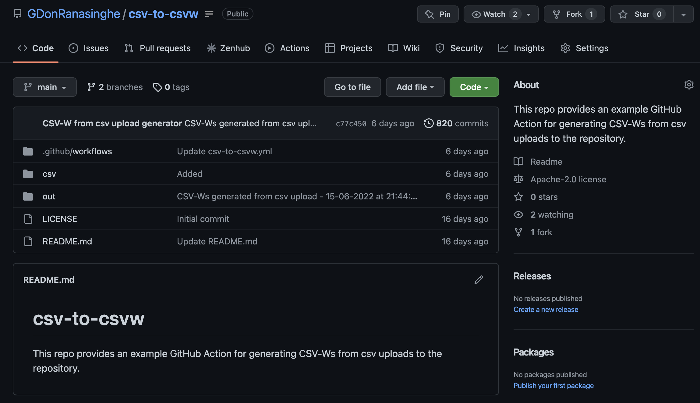
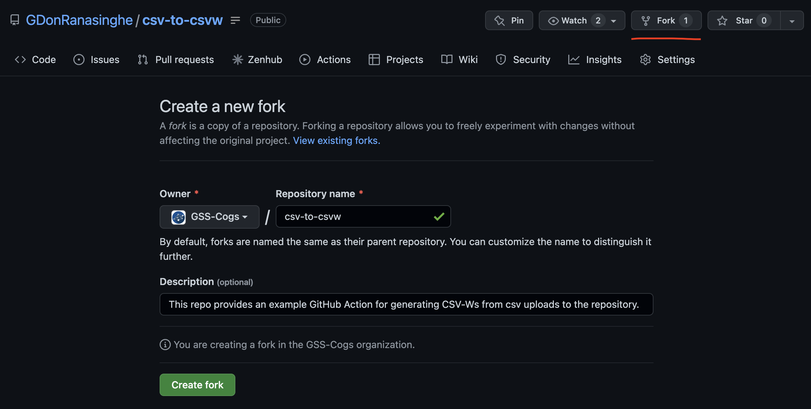
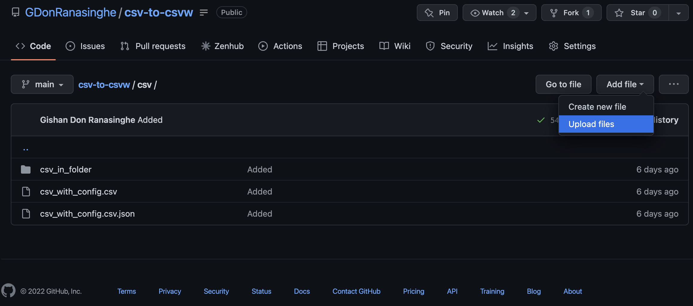
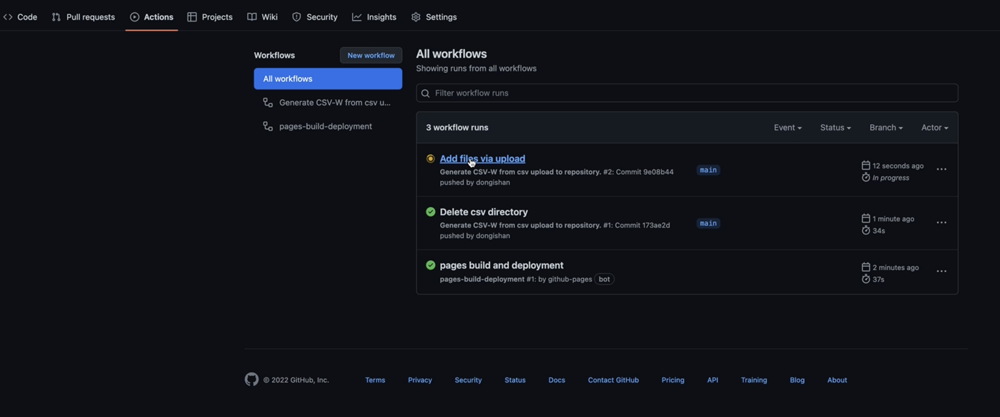
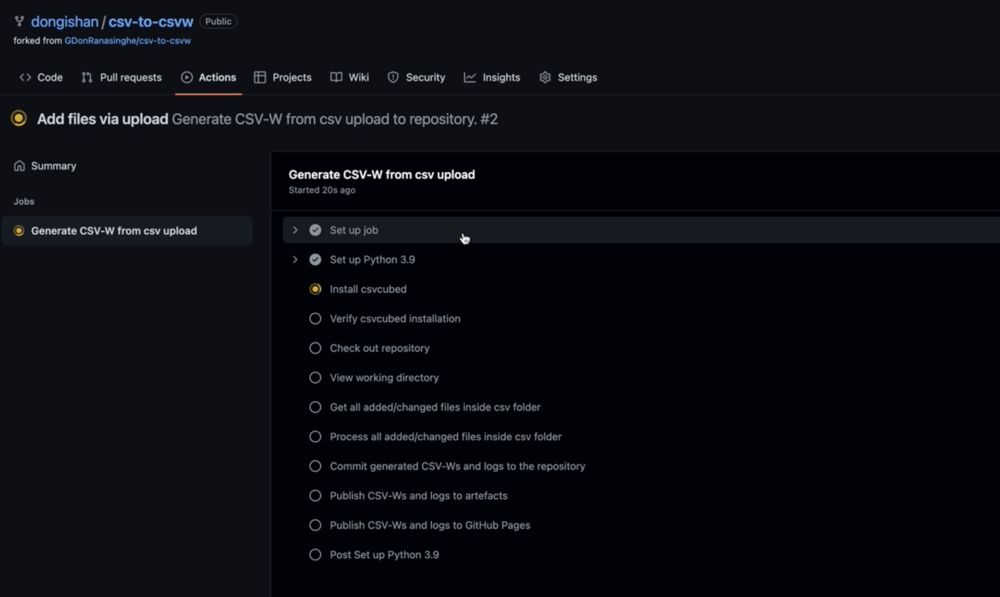
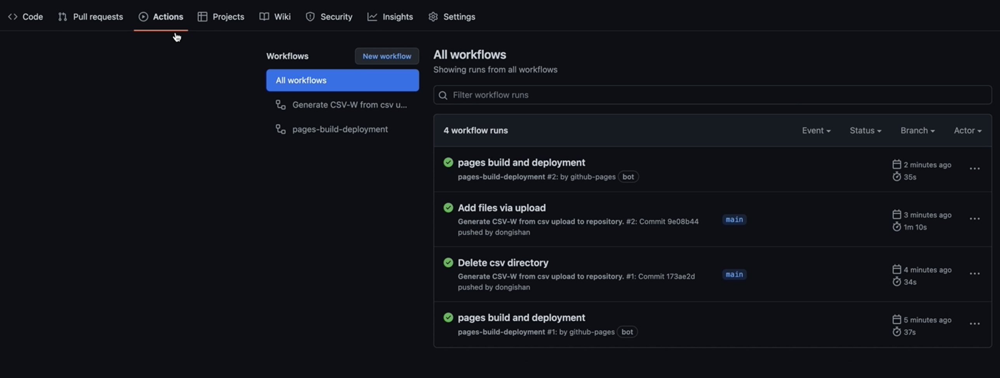
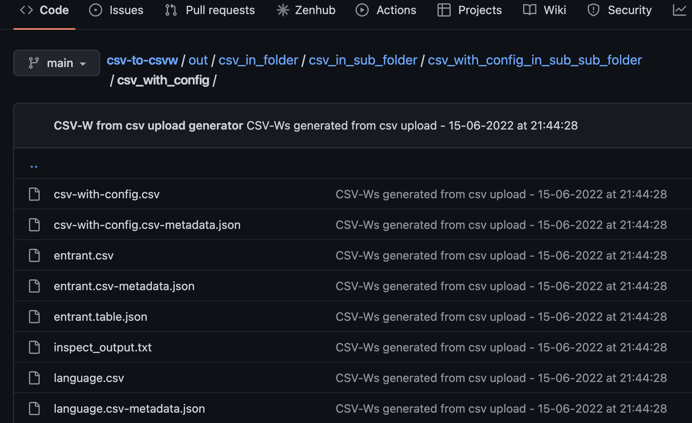
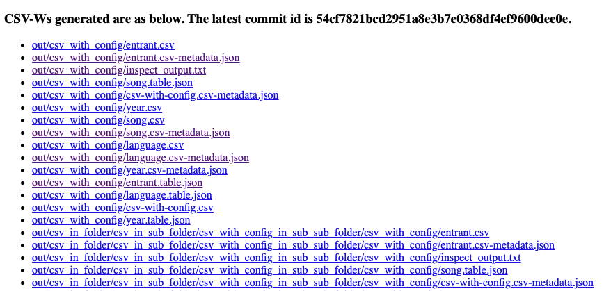

# CSV-to-CSV-W GitHub Action

The CSV-to-CSV-W GitHub action allows generating CSV-Ws by uploading standalone CSVs or CSVs with their configuration JSON counterpart to a GitHub repository. This enables users to employ the csvcubed tool to generate CSV-Ws without needing to install the csvcubed python module, and without any technical knowledge on using python modules through the terminal/command prompt.

## Key Steps Performed by the Action

The GitHub action is available at [CSV-to-CSV-W GitHub Action](https://github.com/GDonRanasinghe/CSV-to-csvw). In this section, an introduction to the key steps performed by this action is provided.

#### Listen to CSV and configuration JSON files commits

The action is triggered when the user commits a CSV and/or a configuration file to the `csv/` folder at the root of the repository. The user can commit these files in any preferred folder structure. An example set of files committed to the repository with various folder structures is available [here](https://github.com/GDonRanasinghe/CSV-to-csvw/tree/main/csv).

Commiting a file to any other location within the repository will NOT trigger the action.

#### Process committed files

Once the files are committed, the action runs the `csvcubed build` and `csvcubed inspect` commands. The outputs produced by the build command are saved at the `out/` folder at the root of the repository. For convenience, the action keeps the same folder structure within the `csv/` folder for the outputs produced. For example, for the `my_data.csv` file at `csv/my_folder/my_data.csv`, the action stores the CSV-Ws at `out/my_folder/my_data/`. 

After running the build command, the action runs the `csvcubed inspect` command on the metadata JSON file within the CSV-W outputs. The inspect command output will also be saved at the `out/` folder similar to the build command output above. For example, for the metadata JSON file at `out/my_folder/my_data/my_data.csv-metadata.json`, a log file called `inspect_output.txt` will be produced and stored at `out/my_folder/my_data/`. This file consists of the inspect command output.

#### Commit generated CSV-Ws and logs to repository

In order to maintain the history of the outputs produced and allow the user to revert changes to the outputs, the action commits the `out/` folder to the repository after running the build and inspect commands.

#### Publish generated CSV-Ws and logs to GitHub artefacts

The action then publishes the CSV-Ws and logs to GitHub artefacts. The user can download a zip file consisting of the CSV-Ws and inspect command output from the artefacts section within the GitHub action run. More information on how to download the artefacts is available in [Download GitHub Action Artefacts](https://docs.github.com/en/actions/managing-workflow-runs/downloading-workflow-artefacts).

#### Publish generated CSV-Ws and logs to GitHub Pages

The action also presents the user with the generated CSV-Ws and logs in a user-friendly GitHub page. In this page, the files in the `out/` folder are listed as downloadable links. The URL to access the GitHub page is provided in GitHub pages setting which is discussed in the [User Manual](#user-manual) section below.

## Organising Inputs

The CSV-to-CSV-W GitHub action expects the user to organise the inputs as per the below criteria.

* The CSV files and their configuration JSONs need to be inside the `csv/` folder.
  
* If a CSV file has a configuration JSON, the filename of the configuration JSON needs to match the filename of the CSV file. For example, `my_data.CSV` and `my_data.csv.json`.

## User Manual

CSV-to-CSV-W GitHub action can be used easily through the GitHub web console. Users who are experienced with GitHub can also clone the repository to the local machine and then commit files using the [GitHub Desktop Client](https://desktop.github.com/) or the [GitHub Command Line Interface](https://cli.github.com/).

To use the CSV-to-CSV-W GitHub action,

1. First fork our example [GitHub repository](https://github.com/GDonRanasinghe/csv-to-csvw). Select your GitHub username as the `Owner` and leave the `Repository name` as it is.

2. Then go to the repository settings and set the branch for GitHub pages - under the `Source` section, set the `Branch` to `gh-pages` and set the folder location to `/(root)`. Also, keep a note of the URL at which your GitHub Pages site is published at.

3. The repository already consists of example inputs (see the `csv/` folder) and the generated outputs (see the `out/` folder). The users can use these input examples to familiarise themselves with the criteria discussed in [Organising Inputs](#organising-inputs).

4. Now that the repository is forked and the GitHub pages settings are configured, the inputs can be committed using the GitHub web console.

5. Once the inputs are committed, the action will start to run and will perform the steps discussed in [Key Steps Performed by the Action](#key-steps-performed-by-the-action). To see the progress of the action, go to the `Actions` section in the GitHub web console.

A more detailed view of the progress of the action can be seen by clicking on the action.

6. Once the CSV-to-CSV-W action is completed, another action called `pages build and deployment` will start to run. This action is responsible for deploying the outputs to the GitHub pages.

7. Now we are ready to explore the outputs produced by the action. First look at the `out/` folder within the repository. If you are using the GitHub Desktop Client or the Github Command Line Interface, make sure to run `git pull` beforehand. The `out/` folder now consists of the CSV-Ws and inspect command logs generated for inputs committed to the repository.

Then download the artefacts produced by the GitHub action. The downloaded folder consists of the CSV-Ws and inspect command logs.

Finally, open the GitHub pages URL noted in Step 2 in the preferred web browser. A web page with all the outputs listed with downloadable links will appear in the browser.
.
