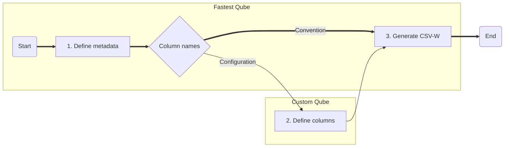

# Configuring a Qube

There are two ways to use csvcubed to generate a valid statictical qube:

* **The convention-first approach** allows you to create a qube with minimal configuration.
* **The configuration-first approach** where you have the full power to configure your qube.

This document goes through, in detail, how to configure your qube whether you wish to use either of the two approaches or a combination of the two. For a quicker overview of the topic take a look at the [Qube Config quick-start](../quick-start/qube-config.md).  

> **Experience of writing basic JSON documents is assumed throughout this document.** 
> See this [tutorial from DigitalOcean](https://www.digitalocean.com/community/tutorials/an-introduction-to-json) for an introduction to writing JSON.

## Qube configuration overview

There are three steps to generating a CSV-W using csvcubed, some of which are optional. 



1. **Define metadata** (Optional)
   Provide information about the CSV-W's contents, such as title, publication date, description, and scope (e.g. start and end date of a time series)
2. **Define columns** (Optional)
   csvcubed has sensible defaults including the assumption that all columns are dimensions unless they have a reserved name (See: [Conventional column names for input `.csv` files](#conventional-column-name))
3. **Generate CSV-W**
   Run `csvcubed build tidy_data.csv (-c qube-config.json)` to generate a CSV-W

If you chose to omit step 2, you **must** ensure that your columns use [conventional names](#conventional-column-name) so that csvcubed can understand how your data is structured. 

### Convention-first method

The conventions used in generating a csvcubed-flavoured CSV-W involve a series of assumptions. These assumptions are always present, even if a configuration approach is used. A summary of the assumptions made by csvcubed are as follows.

* The title of the cube is the name of the csv file in capital case with underscores replaced by spaces.
* Every column which does not use a conventional name is interpreted as a dimension.
* The title of a dimension is taken as the [title case](https://en.wikipedia.org/wiki/Title_case) value of the column header with any underscores replaced by spaces.
* A sibling code list is generated for each conventionally defined dimension. This code list is generated from the unique values present in the data CSV column.
* Observation values are in the observation column and are decimal values.
* Measures are in the measure column, and new measures are created using the unique values in the column unless a URI is present, when that uri is assumed to point to an existing measure.
* Units are in the unit column, and new units are created using the unique values in the column unless a URI is present, when that uri is assumed to point to an existing unit.

#### Conventional Column Names

The following table defines the conventional column names understood by csvcubed:

<!-- TODO: We should ensure to link to a document describing what the different types of component mean. -->

| Component type     | Reserved names                                               | Resulting configuration                                      |
| ------------------ | ------------------------------------------------------------ | ------------------------------------------------------------ |
| Dimension          | none                                                         | A new dimension with the label of the csv column as its title |
| Measure Column     | Measure, measures, measures column, measure column, measure type, measure types | A new measure column with the values within the measure column as new measures unless the values are uris, when csvcubed will assume these are existing measures |
| Observation Column | Observations, obs, values, value, val, vals                  | A new observation column with the values in this column; the data type of this column must be numeric and is assumed to be of type [xsd:decimal](https://www.w3.org/TR/xmlschema11-2/#decimal). |
| Unit Column        | Unit, units, units column, unit column, unit type, unit types | A new unit column with the values within the unit column as new units unless the values are uris, when csvcubed will assume these are existing units |

A valid `.csv` file must have a column of each *component type* to be valid. It is possible to override the default configuration of a conventional column by [configuring a corresponding column mapping](#column-definitions) in a `qube-config.json` file.


### Configuration

Configuring the CSV-W output is done in such a way that the user is explicit in overriding the default values assumed by csvcubed. Every value in the configuration of a cube has a default value, and if it is not overriden it is ether omitted as unnecessary for the production of valid CSV-W or the default value is used.

The `qube-config.json` file has two sections.

1. **Metadata**
   This section is used to describe the dataset's catalog information to aide discovery, provide provinance and publication information, and optionally define the scope of the data set
2. **Define columns**
   This section is used to describe each column in the `.csv` file, classifying the column and defining how the column data is both represented and how it links semantically to other data

### Metadata

A CSV-W file contains metadata which improves discoverability of data publications. In csvcubed, we use a selection of metadata entries from established namespaces to enable users to contribute to the web of data faster. The metadata fields available, their description and defaults are as follows.

| **field name**   | **description**                                              | **default value**                           |
| ---------------- | ------------------------------------------------------------ | ------------------------------------------- |
| `title`          | the title of the cube                                        | A capital case version of the csv file name |
| `description`    | a description of the contents of the cube                    | *none*                                      |
| `publisher`      | a link to the publisher of the cube                          | *none*                                      |
| `creator`        | a link to the creator of the cube                            | *none*                                      |
| `theme`          | a list or a single string of the theme(s) covered by the data (i.e. "trade", "energy", "imports") | *none*                                      |

### Column definitions

A CSV-W file provides detailed information about the columns beyond their values. In csvcubed, we are targeting a level of detail which results in a data cube which can be be expressed using W3C's RDF Cube Vocabulary. A data cube must have a dimension, and observation columns along with at least one unit and measure defined to be valid. A cube may also have one or more attribute columns which provide clarification to observational data. Units and measures may be attached to the observation column (single measure qube), or appear in a column of their own (multi-measure qube).

To define a column in a `qube-config.json` file, provide the column header's value as a dictionary key, and create a new dictionary.

A column is assumed to be a dimension unless otherwise configured using the `type` key or the column being named one of the reserved names. A dimension can still have a `"type": "dimension"` key/value pair.

```json
{ ...
 "columns": {
  "Example column": {
    "type": "dimension"
  }
 }
}
```

#### Dimensions

> The *dimension* [column] serve[s] to identify the observations. A set of values for all the dimension components is sufficient to identify a single observation. Examples of dimensions include the time to which the observation applies, or a geographic region which the observation covers.

Think of the principle of [MECE](https://en.wikipedia.org/wiki/MECE_principle).

#### Measures

> The *measure* [column] represent[s] the phenomenon being observed.

The measure column is effectively another form of dimension.

#### Attributes

> The *attribute* [column] allow us to qualify and interpret the observed value(s). They enable specification of the units of measure, any scaling factors and metadata such as the status of the observation (e.g. *estimated*, *provisional*).

The attribute column can link to resources or literals.

#### Units

The *unit* component is a type of attribute column which provides the units of the observation.

#### Observations

The *observation* column are the numeric values of the observation being recorded in the data set.

#### Using existing columns

To reuse or extend existing dimensions, attributes, units, or measures, provide a `"from_existing": "uri"` key-value pair linking to the RDF subject for the component specification. csvcubed determines whether the column is a reuse of an existing component (e.g. dimension) or requires the extension of an existing component through the configuration of the column.

```json
   "columns": {
      "reused column": {
         "type": "dimension",
         "from_existing": "https://example.org/dimension/years"
      },
      "reused and renamed column": {
         "type": "dimension",
         "from_existing": "https://example.org/dimension/flavours",
         "label": "ice cream flavours"
      }
   }
```

In the example above there are two reused dimensions. For the first existing dimension, "reused column" takes the existing dimension "years" and reuses it without any changes. The second dimension is an example of the creation of a new dimension but showing that ice-cream flavours it is a child dimension of flavours.

Unless the component being reused is a literal attribute and you're providing a `"data_type"` key-value pair, any other key-value pairs provided will change the column to a new component which will extend the linked parent component.

### Shared column configuration options

There are several configuration options available across column types except observations.

| **field name**   | **description**                                              | **default value**                                            |
| ---------------- | ------------------------------------------------------------ | ------------------------------------------------------------ |
| `type`           | The type of the column (Required)                            | *dimension*                                                  |
| `label`          | The title of the column (Optional)                           | The capital case of the header in the csv file with spaces replacing underscores |
| `description`    | A description of the contents of the column (Optional)       | *none*                                                       |
| `from_existing`  | The uri of the resource for reuse/extension (Optional)       | *none*                                                       |
| `definition_uri` | A uri of a resource to show how the column is created/managed (i.e. a uri of a PDF explaining a list of units) (Optional) | *none*                                                       |

The `from_existing` value when set provides the basis of linked data; it allows csvcubed to generate additional RDF-hints to allow users to discover how the `tidy_data.csv` links to other data semanticly.

### Dimension configuration

| **field name**   | **description**                                              | **default value**                                            |
| ---------------- | ------------------------------------------------------------ | ------------------------------------------------------------ |
| `type`           | The type of the column (Required)                            | *dimension*                                                  |
| `label`          | The title of the column (Optional)                           | The capital case of the header in the csv file with spaces replacing underscores |
| `description`    | A description of the contents of the column (Optional)       | *none*                                                       |
| `from_existing`  | The uri of the resource for reuse/extension (Optional)       | *none*                                                       |
| `definition_uri` | A uri of a resource to show how the column is created/managed (i.e. a uri of a PDF explaining a list of units) (Optional) | *none*                                                       |
| `range_uri`      | A uri which describes the range of the values within the column (Optional) | *none*                                                       |
| `uri_override`   | Override the uri created automatically for the column (Optional) (Advanced) | `tidy_data.csv#uri_safe_column_header_from_csv`              |
| `uri_template`   | Override the uri generated for values within the uri (Optional) (Advanced) | **TODO** Look this up                                        |
| `codelist`       | Link to an existing code list (Optional) (Advanced)          |                                                              |

### Attributes

| **field name**   | **description**                                              | **default value**                                            |
| ---------------- | ------------------------------------------------------------ | ------------------------------------------------------------ |
| `type`           | The type of the column (Required)                            | *dimension*                                                  |
| `label`          | The title of the column (Optional)                           | The capital case of the header in the csv file with spaces replacing underscores |
| `description`    | A description of the contents of the column (Optional)       | *none*                                                       |
| `from_existing`  | The uri of the resource for reuse/extension (Optional)       | *none*                                                       |
| `definition_uri` | A uri of a resource to show how the column is created/managed (i.e. a uri of a PDF explaining a list of units) (Optional) | *none*                                                       |
| `data_type`      | The [xml data type](https://www.w3.org/TR/xmlschema-2/#built-in-datatypes) of the contents of the column, if this is provided it becomes a Literal Attribute column (Optional) | *none*                                                       |
| `required`       | If this boolean value is true csvcubed will flag to the user if there are blank values in this column | *none*                                                       |
| `codelist`       | Link to an existing code list (Optional) (Advanced)          | *none*                                                       |

### Observations

Observations are the most important component of a CSV-W data set. Observation columns can have measures and units defined against them to obviate the need for separate unit and measure columns in a single unit/measure data set.

| **field name** | **description**                                              | **default value** |
| -------------- | ------------------------------------------------------------ | ----------------- |
| `data_type`    | The data type of the observations. This should generally be a decimal or integer. (Optional) | *decimal*         |
| `unit`         | The unit for this observation column; this can a uri to an existing unit, or a dictionary containing a new or extended existing unit. If there is a unit column this value must not be provided. (Optional) | *none*            |
| `measure`      | The measure for this observation column; this can be a uri to an existing dimension, or a dictionary containing a new or extneded existing measure. If there is a measure column this key must not be provided. (Optional) | *none*            |

### Measure and Unit Columns

Measure and unit columns are treated slightly differently to dimension, attribute, and observation columns. Measure and unit columns contain references to discrete units and measures. In both cases by defining `"type": "measure column"` or `"type": "unit column"` provides the same behaviour. Do not put measures in units columns and units and measure columns.

| **field name** | **description**                                              | **default value** |
| -------------- | ------------------------------------------------------------ | ----------------- |
| `type`         | The type of the column, provide `"measure column"` for the measure column type or `"unit column"` for the unit column (Required) | *dimension*       |
| `values`       | If basic units/measures are desired, a boolean value of `true` is used to signify to csvcubed to create units/measures from values of this column; otherwise values is a dictionary which defines the units/measures using the notion from [Measures and Units](#Measures and Units) | `true`            |

## Measures and Units

Measures can either be attached to a Measure Column if there are a mixture of measures in your dataset, or to an Observation column if all observations in the cube have the same measure.
Units can either be attached to a Unit Column if there are a mixture of units in your dataset, or to an Observation column if all observations in the cube have the same unit.

### Measures

Measures have no unique configuration options.

| **field name**   | **description**                                              | **default value**                                            |
| ---------------- | ------------------------------------------------------------ | ------------------------------------------------------------
| `label`          | The title of the measure (Required; Optional if `from_existing` defined)                           | *none* |
| `description`    | A description of the contents of the measure (Optional)       | *none*                                                       |
| `from_existing`  | The uri of the resource for reuse/extension (Optional)       | *none*                                                       |
| `definition_uri` | A uri of a resource to show how the measure is created/managed (i.e. a uri of a PDF explaining the measure type) (Optional) | *none*                                                       |

### Units

Units are effectively attributes with additional options.

| **field name**      | **description**                                              | **default value**                                            |
| ------------------- | ------------------------------------------------------------ | ------------------------------------------------------------
| `label`             | The title of the unit (Required; Optional if `from_existing` defined)                          | *none* |
| `description`       | A description of the contents of the unit (Optional)       | *none*                                                       |
| `from_existing`     | The uri of the resource for reuse/extension (Optional)       | *none*                                                       |
| `definition_uri`    | A uri of a resource to show how the unit is created/managed (i.e. a uri of a image which shows the formula on how the unit is derived) (Optional) | *none*                                                       |
| `scaling_factor`    | The scaling factor (expressed in base 10) is used to define a new unit from an existing base (i.e. "GBP millions" would have a form_existing unit of GBP, and a `"scaling_factor": 1000000`) (Optional) | *none*                                                       |
| `si_scaling_factor` | The si_scaling_factor helps relate common scaled units to source SI units, for example kilograms are 1000 grams. Most of these units are already defined. (Optional) (Advanced) | *none*                                                       |
| `quantity_kind`     | The [QUDT quantity kind](http://www.qudt.org/doc/DOC_VOCAB-QUANTITY-KINDS.html#Instances) helps group units                                                 | *none*                                                       |
