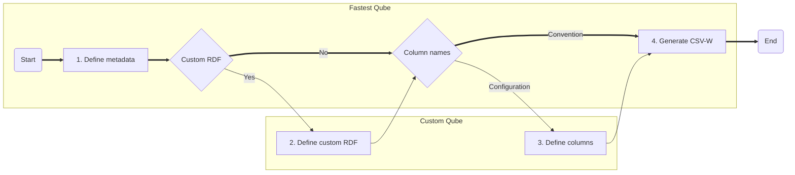

# `qube config.json`

The `qube config.json` file is a mechanism for expressing the configuration of a CSV-W for use by csvcubed's methods and command line interface. It is comprised of two main parts, the catalogue information (i.e. metadata) and the column definitions. Users naming columns in their `.csv` files with reserved names allows for producing RDF Cube Vocabulary-targetted CSV-W with less configuration.

## Getting started

There are three ways to start using a `qube config.json`.

1. Start with a blank `.json` file and providing a key-value of `"$schema": "./cube-config.schema.json"` to be prompted by your IDE of choice for how to build a valid `Qube Config.json` file. (TODO: Update to contian the correct schema url)
2. Use the csvcubed CLI to generate a `qube config.json` file from a target csv file where columns are named according to convention.
3. Suffer through it all by hand (don't do this)

### Conventional column names for input `.csv` files

In a preference to convention over configuration, csvcubed assumes that all columns are dimensions unless otherwise specified. This allows for faster configuration of a `qube config.json`; however the result will not be valid unless the user names their `.csv` file columns in a specific way. The column names are not case sensitive, and only one of measure, observation, and unit column can exist per `.csv` file.

| Component type     | Reserved names                              | Resulting configuration                                      |
| ------------------ | ------------------------------------------- | ------------------------------------------------------------ |
| Dimension          | `none`                                      | A new dimension with the label of the csv column as its title |
| Measure Column     | Measure, measures                           | A new measure column with the values within the measure column as new measures unless the values are uris, when csvcubed will assume these are existing measures |
| Observation Column | Observations, obs, values, value, val, vals | A new observation column with the values in this column; the data type of this column must be numeric and csvcubed assumes `xsd:decimal` |
| Unit Column        | Unit, units                                 | A new unit column with the values within the unit column as new units unless the values are uris, when csvcubed will assume these are existing units |

A valid `.csv` file must have a column of every type as above in order for it to be valid for conversion to CSV-W by csvcubed by using convention over configuration.

## Catalog Information

A CSV-W file contains metadata which improves discoverability of data publications. In csvcubed, we use a selection of metadata entries from established namespaces to enable users to contribute to the web of data faster.

## Sensible defaults

