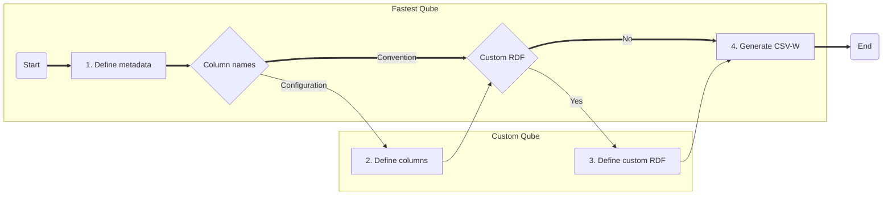

# `qube-config.json`

The `qube-config.json` file is a mechanism for expressing the configuration of a CSV-W for use by csvcubed's methods and command line interface. It is comprised of two main parts, the catalogue information (i.e. metadata) and the column definitions. Users naming columns in their `.csv` files with reserved names allows for producing RDF Cube Vocabulary-targetted CSV-W with less configuration.

## Qube configuration overview

There are four steps, some of which are optional for generating a CSV-W using csvcubed. Depending whether the input `.csv` file is configured to use conventional column names, a compainion `qube-config.json` may not even be required.




1. **Define metadata** (Optional)
   Provide information about the CSV-W's contents, such as title, publication date, description, and scope (e.g. start and end date of a time series)
2. **Define columns** (Optional)
   csvcubed has sensible defaults including the assumption that all columns are dimensions unless they have a reserved name (See: [Conventional column names for input `.csv` files](#Conventional column names for input `.csv` files))
3. **Define custom RDF** (Optional)
   Custom RDF can be used to declare additional triples attached to the data set, or individual columns **TODO:** Further detail
4. **Generate CSV-W**
   Run `csvcubed build tidy_data.csv (-c qube-config.json)` to generate a CSV-W

# Getting started

There are two ways to configure csvcubed using the `qube-config.json` file. Convention requires a tidy data `.csv` file and specific column names. Configuration simplifies the coining of new or child components.

1. **Configuration approach**
   Start with a blank `.json` file and providing a key-value of `"$schema": "./cube-config.schema.json"` to be prompted by your IDE of choice for how to build a valid `qube-config.json` file. (TODO: Update to contian the correct schema url)
2. **Convention approach**
   Use the csvcubed CLI to generate a `qube-config.json` file from a target csv file where columns are named according to convention.

## Convention method

The conventions used in generating a csvcubed-flavoured CSV-W involve a series of assumptions. These assumptions are always present, even if a configuration approach is used. A summary of the assumptions made by csvcubed are as follows; however for further detail see here. **TODO:** do this thing.

* The title of the cube is the name of the csv file in capital case with underscores replaced by spaces
* Every column that doesn't have a reserved name is a new dimension which is local to the data set
* The title of the new dimensions is the capital case of the column header with the underscores replaced by spaces; the uri-safe value for the column is the lowercase, a corresponding SKOS concept scheme and code list is created using the unique values in the dimension column
* Observation values are in the observation column and are decimal values
* Meausres are in the measure column, and new measures are created using the unique values in the column unless a URI is present, when that uri is assumed to point to an existing measure
* Units are in the unit column, and new units are created using the unique values in the column unless a URI is present, when that uri is assumed to point to an existing unit

### Conventional column names for input `.csv` files

As stated earlier in the summary csvcubed assumes that all columns are dimensions unless otherwise specified. This allows for faster configuration of a `qube-config.json` file; however the result will not be valid unless the user names their `.csv` file columns in a specific way. The column names are not case sensitive, and only one of measure, observation, and unit column can exist per `.csv` file.

| Component type     | Reserved names                                               | Resulting configuration                                      |
| ------------------ | ------------------------------------------------------------ | ------------------------------------------------------------ |
| Dimension          | `none`                                                       | A new dimension with the label of the csv column as its title |
| Measure Column     | Measure, measures, measures column, measure column, measure type, measure types | A new measure column with the values within the measure column as new measures unless the values are uris, when csvcubed will assume these are existing measures |
| Observation Column | Observations, obs, values, value, val, vals                  | A new observation column with the values in this column; the data type of this column must be numeric and csvcubed assumes `xsd:decimal` |
| Unit Column        | Unit, units, units column, unit column, unit type, unit types | A new unit column with the values within the unit column as new units unless the values are uris, when csvcubed will assume these are existing units |

A valid `.csv` file must have a column of every type as above in order for it to be valid for conversion to CSV-W by csvcubed by using convention over configuration. All the assumptions and rules (excepting using reserved names for other component types) are overridable by the user in the `qube-config.json` file

## Configuration

Configuring the CSV-W output is done in such a way that the user is explicit in overriding the default values assumed by csvcubed. Every value in the configuration of a cube has a default value, and if it is not overriden it is ether omitted as unnecessary for the production of valid CSV-W or the default value is used.

The `qube-config.json` file has two sections.

1. **Metadata**
   This section is used to describe the dataset's catalog information to aide discovery, provide provinance and publication information, and optionally define the scope of the data set
2. **Define columns**
   This section is used to describe each column in the `.csv` file, classifying the column and defining how the column data is both represented and how it links semantically to other data

## Metadata

A CSV-W file contains metadata which improves discoverability of data publications. In csvcubed, we use a selection of metadata entries from established namespaces to enable users to contribute to the web of data faster. The metadata fields available, their description and defaults are as follows.

| **field name**   | **description**                                              | **default value**                           |
| ---------------- | ------------------------------------------------------------ | ------------------------------------------- |
| `title`          | the title of the cube                                        | A capital case version of the csv file name |
| `description`    | a description of the contents of the cube                    | *none*                                      |
| `publisher`      | a link to the publisher of the cube                          | *none*                                      |
| `creator`        | a link to the creator of the cube                            | *none*                                      |
| `theme`          | a list or a single string of the theme(s) covered by the data (i.e. "trade", "energy", "imports") | *none*                                      |
| `spatial_bound`  | URI that defines the spatial / geographic bounds of the data contained herein | *none*                                      |
| `temporal_bound` | URI that defines the temporal bounds of the data contained herein | *none*                                      |

## Column definitions

A CSV-W file provides detailed information about the columns beyond their values. In csvcubed, we are targeting a level of detail which results in a data cube which can be be expressed using W3C's RDF Cube Vocabulary. A data cube must have a dimension, measure, unit, and observation column to be valid. A cube may also have one or more attribute columns which provide clarification to observational data.

To define a column in a `qube-config.json` file, provide the column header's value as a dictionary key, and create a new dictionary.

A column is assumed to be a dimension unless otherwise configured using the `type` key or the column being named one of the reserved names. A dimension can still have a `"type": "dimension"` key/value pair.

```json
{ ...
 "columns": {
  "Example column": {
    "type": "dimension"
  }
 }
}
```

 ### Choosing the correct column type

Adapted from W3C's [RDF Cube Vocabulary](https://www.w3.org/TR/vocab-data-cube/) Recommendation, selecting the correct column type begins the definition of a column.

#### Dimensions

> The *dimension* [column] serve[s] to identify the observations. A set of values for all the dimension components is sufficient to identify a single observation. Examples of dimensions include the time to which the observation applies, or a geographic region which the observation covers.

Think of the principle of [MECE](https://en.wikipedia.org/wiki/MECE_principle).

#### Measures

> The *measure* [column] represent[s] the phenomenon being observed.

The measure column is effectively another form of dimension.

#### Attributes

> The *attribute* [column] allow us to qualify and interpret the observed value(s). They enable specification of the units of measure, any scaling factors and metadata such as the status of the observation (e.g. *estimated*, *provisional*).

The attribute column can link to resources or literals.

#### Units

The *unit* component is a type of attribute column which provides the units of the observation.

#### Observations

The *observation* column are the numeric values of the observation being recorded in the data set.

### Using existing columns

To reuse or extend existing dimensions, attributes, units, or measures, provide a `"from_existing": "uri"` key-value pair linking to the RDF subject for the component specification. csvcubed determines whether the column is a reuse of an existing component (e.g. dimension) or requires the extension of an existing component through the configuration of the column.

Unless the component being reused is literal attribute and you're providing a `"data_type"` key-value pair, any other key-value pairs provided will change the column to a new component which will extend the linked parent component.

## Shared column configuration options

There are several configuration options available across column types except observations.

| **field name**   | **description**                                              | **default value**                                            |
| ---------------- | ------------------------------------------------------------ | ------------------------------------------------------------ |
| `type`           | The type of the column (Required)                            | *dimension*                                                  |
| `label`          | The title of the column (Optional)                           | The capital case of the header in the csv file with spaces replacing underscores |
| `description`    | A description of the contents of the column (Optional)       | *none*                                                       |
| `from_existing`  | The uri of the resource for reuse/extension (Optional)       | *none*                                                       |
| `definition_uri` | A uri of a resource to show how the column is created/managed (i.e. a uri of a PDF explaining a list of units) (Optional) | *none*                                                       |

The `from_existing` value when set provides the basis of linked data; it allows csvcubed to generate additional RDF-hints to allow users to discover how the `tidy_data.csv` links to other data semanticly.

## Dimenion configuration

| **field name**   | **description**                                              | **default value**                                            |
| ---------------- | ------------------------------------------------------------ | ------------------------------------------------------------ |
| `type`           | The type of the column (Required)                            | *dimension*                                                  |
| `label`          | The title of the column (Optional)                           | The capital case of the header in the csv file with spaces replacing underscores |
| `description`    | A description of the contents of the column (Optional)       | *none*                                                       |
| `from_existing`  | The uri of the resource for reuse/extension (Optional)       | *none*                                                       |
| `definition_uri` | A uri of a resource to show how the column is created/managed (i.e. a uri of a PDF explaining a list of units) (Optional) | *none*                                                       |
| `range_uri`      | A uri which describes the range of the values within the column (Optional) | *none*                                                       |
| `uri_override`   | Override the uri created automatically for the column (Optional) (Advanced) | `tidy_data.csv#uri_safe_column_header_from_csv`              |
| `uri_template`   | Override the uri generated for values within the uri (Optional) (Advanced) | **TODO** Look this up                                        |
| `codelist`       | Link to an existing code list (Optional) (Advanced)          |                                                              |

## Attributes

| **field name**   | **description**                                              | **default value**                                            |
| ---------------- | ------------------------------------------------------------ | ------------------------------------------------------------ |
| `type`           | The type of the column (Required)                            | *dimension*                                                  |
| `label`          | The title of the column (Optional)                           | The capital case of the header in the csv file with spaces replacing underscores |
| `description`    | A description of the contents of the column (Optional)       | *none*                                                       |
| `from_existing`  | The uri of the resource for reuse/extension (Optional)       | *none*                                                       |
| `definition_uri` | A uri of a resource to show how the column is created/managed (i.e. a uri of a PDF explaining a list of units) (Optional) | *none*                                                       |
| `data_type`      | The xml data type of the contents of the column, if this is provided it becomes a Literal Attribute column (Optional) | *none*                                                       |
| `required`       | If this boolean value is true csvcubed will flag to the user if there are blank values in this column | *none*                                                       |
| `codelist`       | Link to an existing code list (Optional) (Advanced)          | *none*                                                       |

## Observations

Observations are the most important component of a CSV-W data set. Observation columns can have measures and units defined against them to obviate the need for separate unit and measure columns in a single unit/measure data set.

| **field name** | **description**                                              | **default value** |
| -------------- | ------------------------------------------------------------ | ----------------- |
| `data_type`    | The data type of the observations. This can only be decimal or integer. (Optional) | *decimal*         |
| `unit`         | The unit for this observation column; this can a uri to an existing unit, or a dictionary containing a new or extended existing unit. If there is a unit column this value must not be provided. (Optional) | *none*            |
| `measure`      | The measure for this observation column; this can be a uri to an existing dimension, or a dictionary containing a new or extneded existing measure. If there is a measure column this key must not be provided. (Optional) | *none*            |

## Measure and Unit Columns

Measure and unit columns are treated slightly differently to dimension, attribute, and observation columns. Measure and unit columns contain references to discrete units and measures. In both cases by defining `"type": "measure column"` or `"type": "unit column"` provides the same behaviour. Do not put measures in units columns and units and measure columns.

| **field name** | **description**                                              | **default value** |
| -------------- | ------------------------------------------------------------ | ----------------- |
| `type`         | The type of the column, provide `"measure colum"` for the measure column type or `"unit column"` for the unit column (Required) | *dimension*       |
| `values`       | If basic units/measures are desired, a boolean value of `true` is used to signify to csvcubed to create units/measures from values of this column; otherwise values is a dictionary which defines the units/measures using the notion from [Measures and Units](#Measures and Units) | `true`            |

# Measures and Units

Measure and units can be attached to a Measure and Unit Column

## Measures

Measures have no unique configuration options.

| **field name**   | **description**                                              | **default value**                                            |
| ---------------- | ------------------------------------------------------------ | ------------------------------------------------------------ |
| `type`           | The type of the column (Required)                            | *dimension*                                                  |
| `label`          | The title of the column (Optional)                           | The capital case of the header in the csv file with spaces replacing underscores |
| `description`    | A description of the contents of the column (Optional)       | *none*                                                       |
| `from_existing`  | The uri of the resource for reuse/extension (Optional)       | *none*                                                       |
| `definition_uri` | A uri of a resource to show how the column is created/managed (i.e. a uri of a PDF explaining a list of units) (Optional) | *none*                                                       |

## Units

Units are effectively attributes with additional options

| **field name**      | **description**                                              | **default value**                                            |
| ------------------- | ------------------------------------------------------------ | ------------------------------------------------------------ |
| `type`              | The type of the column (Required)                            | *dimension*                                                  |
| `label`             | The title of the column (Optional)                           | The capital case of the header in the csv file with spaces replacing underscores |
| `description`       | A description of the contents of the column (Optional)       | *none*                                                       |
| `from_existing`     | The uri of the resource for reuse/extension (Optional)       | *none*                                                       |
| `definition_uri`    | A uri of a resource to show how the column is created/managed (i.e. a uri of a PDF explaining a list of units) (Optional) | *none*                                                       |
| `scaling_factor`    | The scaling factor (expressed in base 10) is used to define a new unit from an existing base (i.e. "GBP millions" would have a form_existing unit of GBP, and a `"scaling_factor": 1000000`) (Optional) | *none*                                                       |
| `si_scaling_factor` | The si_scaling_factor helps relate common scaled units to source SI units, for example kilograms are 1000 grams. Most of these units are already defined. (Optional) (Advanced) | *none*                                                       |
| `quantity_kind`     | ¯\\_(ツ)_/¯                                                  | *none*                                                       |

## 
